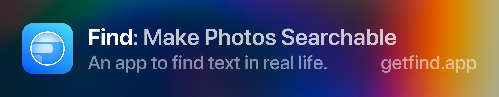

## 👋 Hi there! I'm A. Zheng, an iOS developer.

<table>
<tr>
<td colspan="4">
I like Swift and anime... currently watching『Ijiranaide, Nagatoro-san』〜 Want to check out my app? 
</td>
</tr>

<tr>
<td>
<strong>Working on...</strong>
</td>
<td>
<strong>Learning...</strong>
</td>
<td>
<strong>Planning...</strong>
</td>
<td>
<strong>Playing...</strong>
</td>
</tr>

<tr>
<td>
<a href="https://getfind.app/">Find<a>, my first and most fully-featured app
</td>
<td>
Web Dev — starting with HTML, CSS, JS
</td>
<td>
Big updates to Find
</td>
<td>
<a href="https://stackoverflow.com/users/14351818/aheze">SO<a>
</td>
</tr>

<tr>
<td>
<a href="https://github.com/aheze/ProgressGif">ProgressGif<a>, an open-source app
</td>
<td>
Swift — still a lot more to learn
</td>
<td>
A vtuber maker app
</td>
<td>
<a href="https://www.minecraft.net/en-us/">Minecraft<a>
</td>
</tr>

<tr>
<td>
<a href="https://github.com/aheze/SupportDocs">SupportDocs<a>, with <a href="https://github.com/hkamran80">H. Kamran<a>
</td>
<td>
Drawing — it's pretty fun
</td>
<td>
New open-source libraries
</td>
<td>
<a href="https://agma.io/">agma.io<a>
</td>
</tr>

<tr>
<td>
<i>Check out my <a href="https://aheze.medium.com/">blog<a>!</i>
</td>
<td>
<i><a href="https://discord.com/users/743230678795288637">Discord<a> • <a href="https://www.reddit.com/user/aheze">Reddit<a> • <a href="mailto:aheze@getfind.app">Email<a></i>
</td>
<td colspan="2">

</td>
</tr>

</table>

